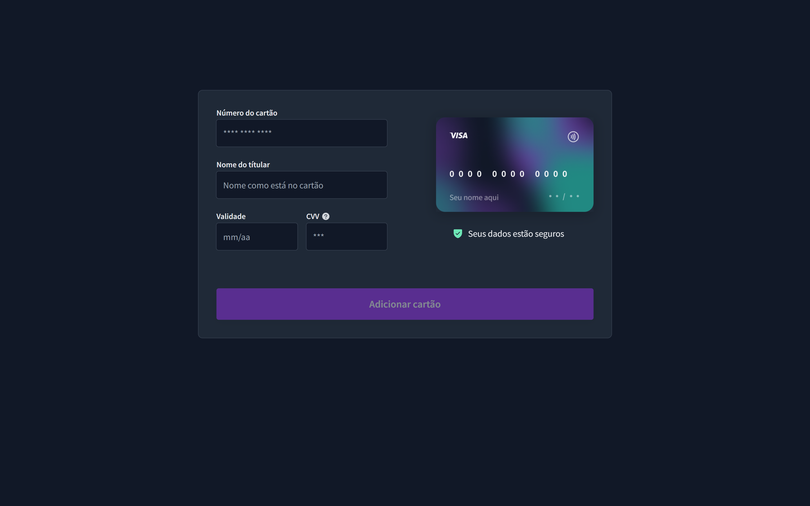

<h1 align="center"> Formulário de um Cartão de Crédito - BoraCodar#13 </h1>

[Clique aqui para acessar](https://maik-emanoel.github.io/credit-card-form/)

## 🚀 Tecnologias

Esse projeto foi desenvolvido com as seguintes tecnologias:

- HTML
- CSS
- JavaScript
- Git and GitHub

## 💻 Projeto

Este é um projeto de uma interface de um Formulário de Cartão de Crédito. 

Obs: Projeto construído a partir do layout proposto no desafio [#BoraCodar13](https://boracodar.dev/) realizado pela [Rocketseat](https://rocketseat.com.br).
Após o desenvolvimento do projeto inicial, adicionei novas features, tais quais:

- Layout responsivo (Adaptado para telas menores)
- Animação ao tocar no cartão
- Inputs com pequenas validações
- Mensagem de êxito
- Mudança do tipo do cartão de acordo com o número inicial
- Entre outras pequenas modificações.

## 🔖 Layout

Você pode visualizar o layout do projeto proposto através [DESSE LINK](https://www.figma.com/community/file/1222904930776225825). É necessário ter conta no [Figma](https://figma.com) para acessá-lo.